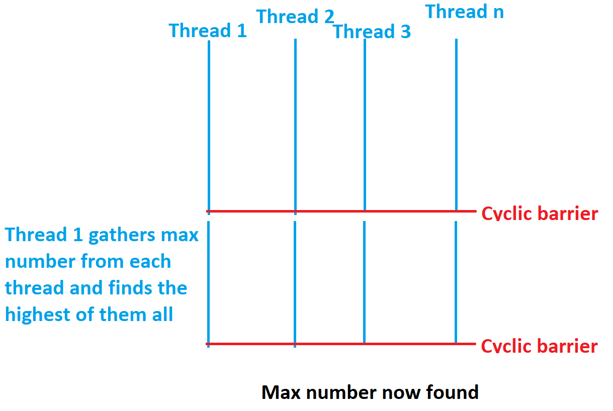
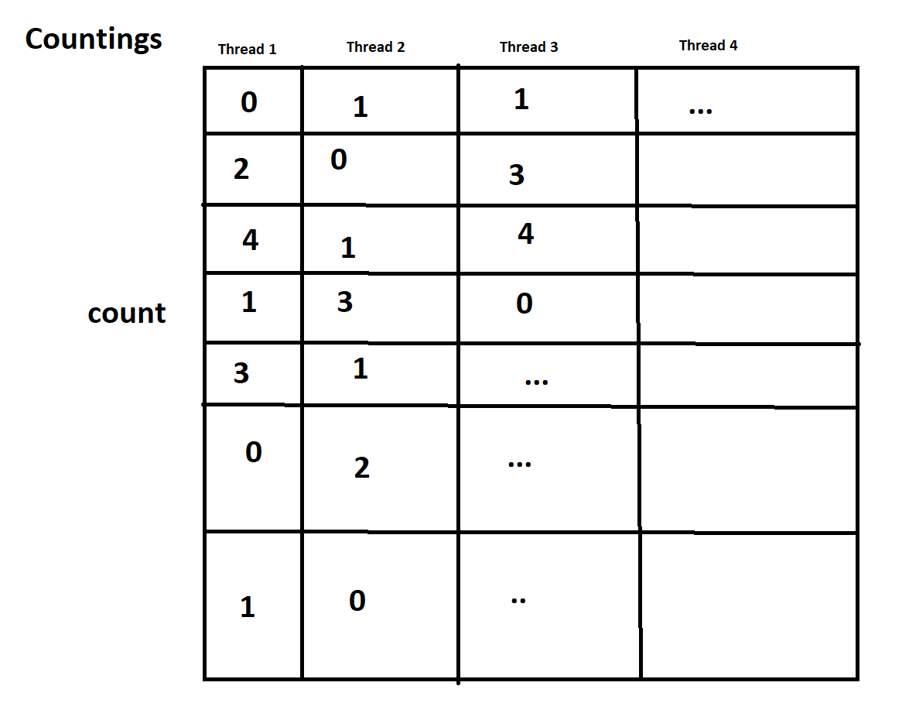
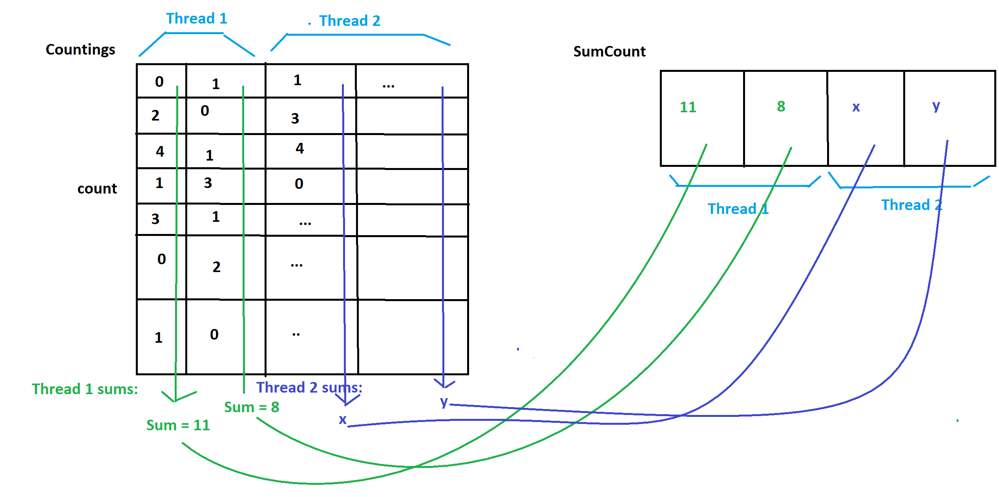
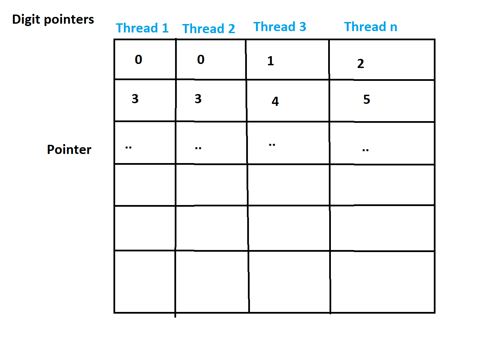

# IN4030-oblig-4

## Introduction – what this report is about
This report is about the parallelization of the sorting algorithm Radix sort. Radix sort is a fast algorithm which does
not use comparisons whenever doing it's sortings (in comparison to e.g bubble sort). It works by grouping individual
digits that share the same significant positon and value. it uses counting sort as a subroutine to sort an array of
numbers. For parallelization, we want to have to have threads working concurrently in the sorting algorithm. More
specifically, the threads has to concurrently execute the 4 steps:
- find max value of the array 
- Count the different digit values in the array 
- Sum these countings & conclude where to insert the digits 
- Move elements from the array based on the conclusion of where to insert the digits.

## 2. User guide – how to run your program (short, but essential), include a very simple example.
#### Build the program
   Build the program by running the command:
   ```
   mvn clean install -Dskiptests
   ```

#### Run the program:
Run the program by running the command:
```
java -cp target/IN4030-oblig-4-1.0-SNAPSHOT.jar src.MainParallelSort <n> <seed> <useBits> <threads>
```
- n - The program will generate n amount of random numbers. 0 means it will generate for these numbers: 1000, 10 000,
  100 000, 1 mill, 10 mill og 100 mill
- seed - Seed to generating random numbers
- useBits - How many bits we when sorting the digits. Most efficiently between 8-11
- threads - how many threads to use in the parallel sorting. 0 means to use your computer's amount of cores.

#### Examples of running:
Running for 100 000 with seed of 3, using 8 bits and all cores of the computer
```
java -cp target/IN4030-oblig-4-1.0-SNAPSHOT.jar src.MainParallelSort 100000 3 8 0
```

Running tests for the numbers 1000, 100 000, 1 mill etc.
```
java -cp target/IN4030-oblig-4-1.0-SNAPSHOT.jar src.MainParallelSort 0 3 8 0
```


### 3. Parallel Radix sort – how you did the parallelization – consider including drawings
###### Step A:
First step was to find the highest number in the array to sort. All threads had a subset of the array to search (divided evenly) within as such:

All threads searched for the highest number in it's subset. If a thread finished, it waits in a cyclic barrier as such:

After all the threads are done finding it's max number, first cyclic barrier is released and thread 1 will start gathering the max number from
all the other threads and finally conclude the max number. Meanwhile, the other threads are waiting in the next cyclic barrier. Once thread 1 is finished, it hits the second cyclic barrier
and all threads are ready to proceed.

###### Step B:
Step b was to count the number of occurrences of each digit in a specific position
First we created a counter which is shared among all threads (two-dimensional). After that:
- Each thread goes through it's subset of the array
- Each thread counts the occurences of each digitvalue in the subset of the array
- These countings are inserted into the shared counting array which all threads are aware of
- After this process, all the threads stops and waits for eachother to finish by using cyclic barrier.


###### Step C:
This step was to sum the countings we've done in step B.
The two-dimension counting table looks e.g like this now:

The task is to sum these countings. I did it the following way:
- I had to divide the table appropriate so that multiple threads could sum on it simultaneous.
- I let the first thread do this division of responsibility among the threads. The sum operation was distributed to threads as such:
  
  As we see in the illustration above, thread 1 does distribute the columns in countings and elements in sumCount evenly among all threads.
  
- Now we have to actually perform the summing as such:
  
  After the summing, all threads has to again synchronize and wait for eachother to finish.

###### Step D:
The final step of the parallelizatrion is to move the content from a[] to b[] accordingly to the content of the count[]. 
I solved this by first creating an multi-dimentional array of digit pointers.

I made this by using thread 1. Thread 1 iterated the allCount[][] for concluding the position which each thread should be reading from

Now I just had to make the flip of numbers to array b[] based on the Digit pointer table which was just created.
This operation is illustrated in the image below:


Now all threads has to synchronize again.
After it's done, we swap again so the unsorted array is now b[] and b[] is now unsorted array.
Based on how many positions we categorize the digits in, we might have to repeat this whole process again (except findMax). This is done in a for loop.


### 4. Implementation – a somewhat detailed description of how your Java program works & how tested
The MainParallelSort method is used for launching the program. See user guide for how to run it.
The program works by that the MainParallelSort class creates worker instances which is going to do the radix sort in paralell.
For synchronization between the workers, I've based it on cyclic barrier so that each thread has to wait for the other threads to finsih before proceeding.
At the end of the program, the main thread waits for all worker threads to complete before finishing.
Each worker threads has an instance of "ParaallelRadixSortCommon" which basically consists of the common data which should be shared and accessible among all threads such as counters.
The benchmark consists of the jmh tests which is necessary for the IN4030 requirements.


Regarding testing of the program, it's tested every time you run it by checking that:
1. Sequential ordered array is correctly sorted
2. Parallel ordered array is correctly sorted.
3. Sequential and parallel ordered array are equal.


### 5. Measurements – includes discussion, tables, graphs of speedups, number of cores used
Note: Time in in milliseconds
#### Cores used: 8

##### Results
| n     | Sequential    | Parallel  | Speedup|
|-------|---------------|-----------|--------|
|1000   |0.2471         |6.3933     |0.038   |
|10000  |0.305          |1.417      |0.215   |
|1000000|19.072         |6.204      |3.074   |
|10000000|176.740       |50.511     |3.499   |
|100000000|2205.291     |431.963    |5.105   |


#### Discussion of the speedups
From the speedup, we can see that for low n (lower than 1000000) we don't get any speedup. This is likely due to the reason of n being so slow, so the sequential
algorithm is completing fast, while the paralell has to create tasks etc which creates some overhead and takes time. So for small numbers, we see that parallelization of the Radix sort goes not go faster.
Whenever we're reaching higher numbers however (1000000 and higher) we see that we're achieving great speedups. Due to the higher number, it takes longer time & makes the overhead of creating threads less significant in total.
We can also notice that as n continues to rise, we're achieving an even greater speedup, so the higher the number, the more efficient it is to run it parallelized. Having each step of the radix sort
parallelized (findMax, counting, digipointers) etc gives a great advantage as we can utilize multiple threads thus making the algorithm much faster. As msot of the work is distributed among all threads, they rarely have to wait longer for eachother too.


#### IN4030 benchmarks (Java Measurement Harness)
The harness can be run using the command:
```
java -jar target/benchmarks.jar
```

When I ran the harness, I got the following results for n = 100_000_00
#### Parallel:
```
# Run progress: 0.00% complete, ETA 00:01:20
# Fork: 1 of 1
# Warmup Iteration   1: 0.152 s/op
Iteration   1: 0.148 s/op
Iteration   2: 0.151 s/op
Iteration   3: 0.152 s/op


Result "src.Benchmarks.testParallel":
  0.150 ±(99.9%) 0.032 s/op [Average]
  (min, avg, max) = (0.148, 0.150, 0.152), stdev = 0.002
  CI (99.9%): [0.118, 0.182] (assumes normal distribution)

```

#### Sequential
```
# Run progress: 50.00% complete, ETA 00:00:40
# Fork: 1 of 1
# Warmup Iteration   1: 0.300 s/op
Iteration   1: 0.308 s/op
Iteration   2: 0.299 s/op
Iteration   3: 0.293 s/op


Result "src.Benchmarks.testSequential":
  0.300 ±(99.9%) 0.137 s/op [Average]
  (min, avg, max) = (0.293, 0.300, 0.308), stdev = 0.008
  CI (99.9%): [0.163, 0.437] (assumes normal distribution)
```

#### Comparison:
```
Benchmark                  Mode  Cnt  Score   Error  Units
Benchmarks.testParallel    avgt    3  0.150 ± 0.032   s/op
Benchmarks.testSequential  avgt    3  0.300 ± 0.137   s/op
```

For these tests I chose to run the tests with warmup = 1. It means that it warms up by running once before starting the initial operations of sorting the algorithms.
The measurement here is the average time it took to run the algorithm out of 3 runs. For the parallel algorithm we see that it's taking on average 150ms to run, which is
abit higher than the previous measurements when running a median of 7 times. The reason however, is that this test has to also create random digits which it adds into the time measurement. That's why we're seeing such overhead.
The sequential algorithm runs on average 0.300ms. This is just like the parallell algorithm abit higher than our previous measurement, and the reason is likely also here that we're creating random numbers within the measurement.
we still see there's a speed up 2 however, which means that the parallel algorithm runs twice as fast.

### 6. Conclusion – just a short summary of what you have achieved
In this project, I've managed to create a parallel algorithm for running the radix sort. From the results, we can see that for high numbers of n (many numbers to sort), this algorithm performs
significantly faster than if it was to run sequentially. Our greatest speedup in the results was 5 for n = 100000000 which means it ran 5 times as fast when running in parallel. We also see that for low numbers,
running this in parallel does not increase the speed of the algorithm, but rather slows it down due to the overhead of creating threads etc.


#### How radix sort works (Not neccesairy to read for examiner)

##### For playing cards

- For player cards, we first establish 13 slots
- Then we stack each card in their slot (e.g 2 goes to slot number 2)
- After that, we'll sort based on the suits.
- First we collect them
- Then we sort them by suit (using 4 slots)
- Then we have a sorted deck of cards. Tadaa

##### For numbers

First, we have a serial of the numbers:
170 061 512 503 693 703 154 275 765 087 987 677 509 908

- First thing we do is to mark which digit we start sorting on. In this case the last digit of each digit (e.g 0 for
  170)
- We can sort these into 10 slots (0-9)
- Then we take the numbers each at a time, and dump them into such categories as such:
  0: 170 1: 061 2: 512 3: 503 693 703 4: 154 5: 275 765 6:
  7: 087 897 677 8: 908 9: 509

Now we're done with the first "pass". Now we identify them by their second digits as such:
0: 503 703 908 509 1: 512 2:
3:
4:
5: 156 6: 061 765 7: 170 275 677 8: 087 9: 693 897

Now we're done with the second "pass". We've sorted on the 2 lower digit. Lastly we're gonna order by the last digit:
0: 061 087 1: 154 170 2:
3:
4:
5: 503 509 512 6: 677 693 7: 703 765 8: 897 9: 908

And now we see that we have a sorted list!

- When we're creating these 'slots', they should be "n" long, as potentially, all numbers could end up in one slot
- So algorithm needs to have 10 * n space which is quite high.
- What we can do is to optimize the requirement for space to 2*n as such:
  Given the numbers again:
  170 061 512 503 693 703 154 275 765 087 987 677 509 908

So we start do add the last digit to slots, just like before, but now we count them:
0: 1 (0 which means starts at index)
1: 1 (1)
2: 1 (2)
3: 3 (3)
4: 1 (6)
5: 2 (7)
6: 0 (9)
7: 3 (9)
8: 1 (12)
9: 1 (13)

Then we have a second array, where we allocate the slots in. so for e.g 0 entry is the first slot. And then the next
entry (which is 1 digits) is at slot number 1 Then the next slot is 2 which starts at slot 2 Then the next slot is 3, so
we have 3 slots for that.

- This means that as we're grabbing the numbers from the first array, we also have the indexes for where to put them. So
  the array looks like this:
  [170 (0), 061 (1), 512 (2), 503 (3), 693 (3), 703 (3), 154 (4), 275, 765, ....]
  We basically keep a counter of where to insert the numbers. So we've copied over the entries to an array of size N,
  and we have 2 arrays of size N. We're basically using an array N as a helper as we saw. Then we can basically continue
  by replacing the first array again, using it as an helper. So we swap these during each "pass"  

